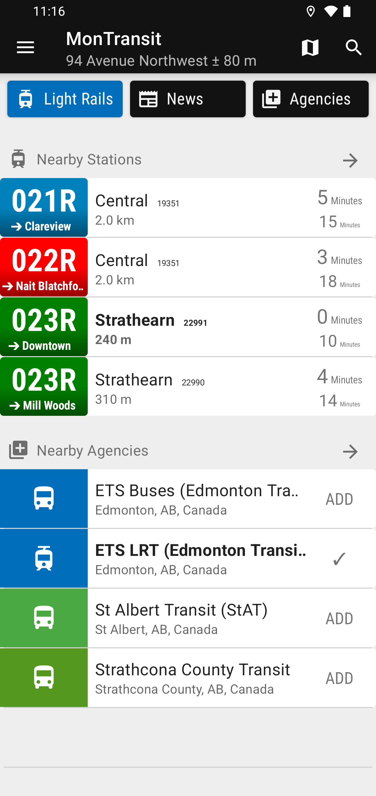
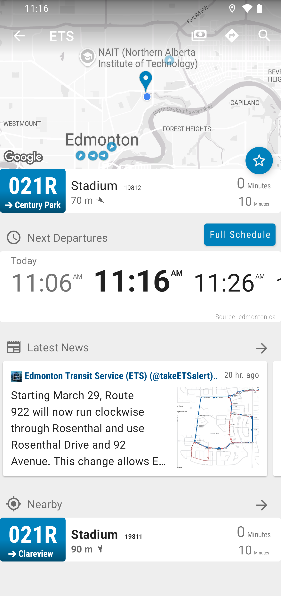
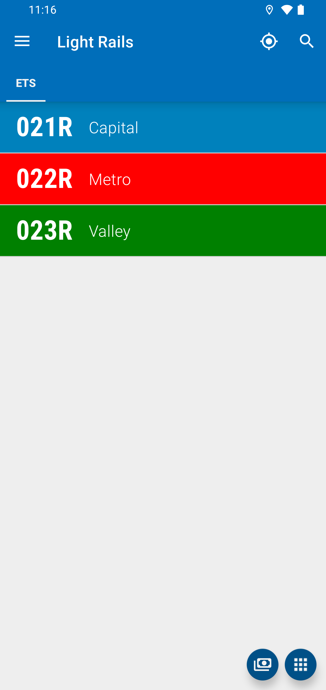

# Edmonton ETS LRT (Light Rail Transit) for [MonTransit](https://github.com/mtransitapps/mtransit-for-android)

## Download on Google Play

## Screenshots

## Social

* [MonTransit BETA Google+ Community](https://plus.google.com/communities/111796337224469270605)

## License

* [Apache Version 2.0](http://www.apache.org/licenses/LICENSE-2.0.html)
